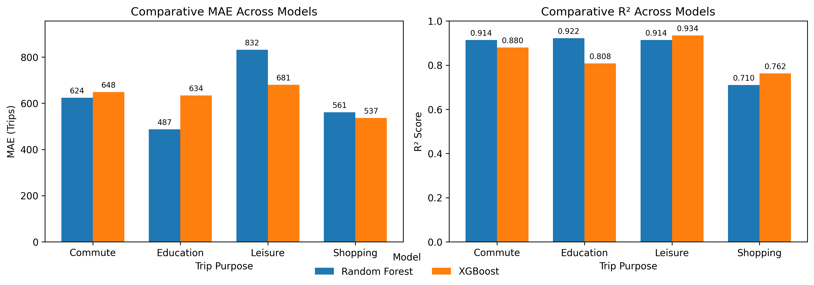

# Multiclass Inference of Urban Cycling Trip Purposes Using Geospatial Big Data

## 📘 Overview
This project applies **geospatial machine learning** to infer cycling trip purposes in post-pandemic London using **Transport for London (TfL)** Cycle Hire data and **OpenStreetMap** land-use context.  
It builds a **multiclass model** to classify trips as **commuting, leisure, education, or shopping**, combining temporal indicators, spatial proximity, and contextual data in a scalable analytical framework.

> **Objective:** Develop a transparent, hybrid model that classifies cycling trip purposes using spatial-temporal data and evaluates post-pandemic mobility patterns.

---

## 🗺️ Motivation
While cycling data is abundant, understanding *why* people cycle remains limited.  
Existing studies often simplify behaviour into binary (commute vs. non-commute) categories.  
This project fills that gap by:
- Integrating **geospatial big data** and **temporal analytics**.  
- Implementing a **multiclass classification model** for trip purpose inference.  
- Applying **SHAP explainability** to ensure transparency.  
- Providing **spatially complete predictions** for unlabelled areas using H3 hexagonal grids.

---

## ⚙️ Technologies Used
| Category | Tools & Libraries |
|-----------|------------------|
| **Core Language** | Python 3.12 |
| **Data Handling** | pandas, numpy |
| **Geospatial Processing** | geopandas, shapely, h3, osmnx |
| **Machine Learning** | scikit-learn, xgboost, imbalanced-learn |
| **Explainability** | shap |
| **Visualization** | matplotlib, seaborn, kepler.gl, folium |
| **Evaluation & Utilities** | joblib, tqdm, scipy |

---

## 📂 Dataset Overview
| Source | Description | Period |
|---------|--------------|--------|
| TfL Cycle Hire | Trip-level data with timestamps, duration, start & end stations | Jan – Dec 2024 |
| TfL XML Feed | Official station metadata (ID, name, lat/lon) | Real-time |
| OpenStreetMap | Points of interest for parks, schools, retail, and transport hubs | 2024 |
| Digimap (UK) | Supplementary land-use data | 2024 |

Data was cleaned, geocoded, and spatially joined to nearby POIs within **100–200 m** buffers.

---

## 🧮 Methodology
The analytical framework consists of four stages:

1. **Data Integration** – Combine TfL trips, station coordinates, and OSM POIs.  
2. **Spatial Aggregation (H3 Level 9)** – Assign trips to ~0.3 km² hexagonal cells to avoid boundary bias.  
3. **Feature Engineering & Rule-Based Labelling** – Generate supervised labels using temporal windows and POI proximity.  
4. **Model Development & Interpretation** – Train, evaluate, and explain models using Random Forest and XGBoost.

---

## 🧩 Feature Engineering
Spatial and temporal predictors were derived as follows:

| Feature | Type | Description |
|----------|------|-------------|
| `dist_park` | Spatial | Euclidean distance to nearest park |
| `dist_school` | Spatial | Distance to nearest school/university |
| `dist_retail` | Spatial | Distance to nearest retail/commercial zone |
| `dist_transport` | Spatial | Distance to nearest rail/metro hub |
| `start_hour` | Temporal | Hour of trip start |
| `is_weekend` | Temporal | Weekend indicator |
| `weekday_weekend_ratio` | Temporal | Ratio of weekday to weekend trips |

Rule-based labelling defined the four purposes (e.g. *weekday AM near transport hub → commute*).

---

## 🤖 Model Implementation
Three models were tested:
- **Logistic Regression:** Baseline for linear separability.  
- **Random Forest:** Robust, interpretable, handles feature interactions.  
- **XGBoost:** Gradient-boosting model for non-linear, sparse patterns.  

A **hybrid strategy** was adopted based on empirical performance:
- Random Forest → *commuting, education*  
- XGBoost → *leisure, shopping*

Hyperparameter tuning used `RandomizedSearchCV` (5-fold CV), evaluated with **MAE** and **R²**.

---

## 📈 Results Summary
| Trip Purpose | Best Model | MAE | R² |
|---------------|-------------|------|------|
| Commute | Random Forest | **624.27** | **0.9137** |
| Education | Random Forest | **487.40** | **0.9220** |
| Leisure | XGBoost | **680.58** | **0.9342** |
| Shopping | XGBoost | **536.65** | **0.7625** |

  
*Figure 2. Comparative MAE and R² across trip purposes.*

---

## 🌍 Spatial Predictions
Predictions were extended to **3,079 unlabelled hexagons** to estimate city-wide trip purposes.

  
*Figure 3. Random Forest predictions for unlabelled hexagons.*

  
*Figure 4. XGBoost predictions for unlabelled hexagons.*

The hybrid configuration combined RF stability in structured areas with XGB flexibility in diffuse outer boroughs.

---

## 🔍 Explainability with SHAP
SHAP (Shapley Additive Explanations) quantified the contribution of each feature to predictions.

  
*Figure 5. SHAP feature importance for trip-purpose prediction using XGboost.*

  
*Figure 6. SHAP feature importance for trip-purpose prediction using XGboost.*

**Top predictors by category:**
- **Commute:** Proximity to transport hubs, trip intensity  
- **Education:** Proximity to schools/universities  
- **Leisure:** Distance to parks, weekend indicator  
- **Shopping:** Distance to retail zones, midday hours  

This ensured the model was not a “black box” and that feature effects were interpretable for policy translation.

---

## 🧠 Key Insights
- **Leisure** now dominates post-pandemic cycling demand in London.  
- **Commuting** and **education** flows remain central along transit corridors.  
- **Shopping** predictions reveal more dispersed, localised behaviour.  
- SHAP analysis highlights **land-use proximity** and **temporal windows** as key drivers.  
- The **hybrid RF–XGB model** improved accuracy by leveraging algorithm strengths across purpose types.

---
🧾 License

This project is licensed under the MIT License – see the LICENSE
 file for details.

🙌 Acknowledgements

Supervised by Dr Tongxin Chen, University of Hull.
Data from Transport for London (TfL) and OpenStreetMap.
Developed as part of the MSc in Artificial Intelligence and Data Science (2024–2025).

📚 Citation

If you use this repository, please cite:

Yusuff, J. (2025). Multiclass Inference of Urban Cycling Trip Purposes Using Geospatial Big Data:
A Post-Pandemic Analysis of London Cycle Hire Patterns. University of Hull.

🚧 Future Work

Incorporate dynamic covariates (weather, footfall, events).

Replace Euclidean with network-based distances.

Implement spatial cross-validation and uncertainty quantification.

Extend framework to shared e-bikes and scooters.

🧭 Contact

Author: Joseph Yusuff
📧 joseph.yusuff12@gmail.com

🔗 LinkedIn
